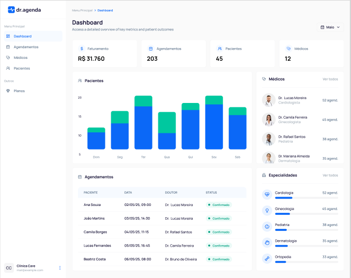
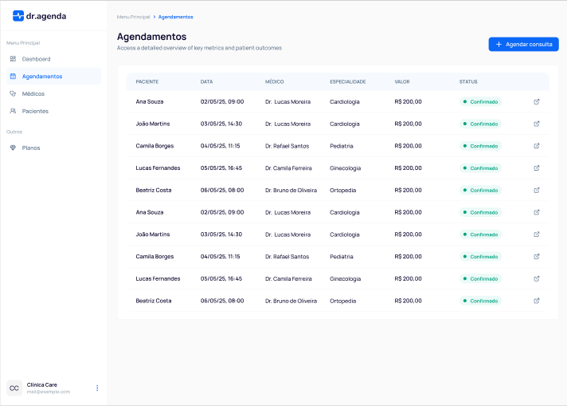
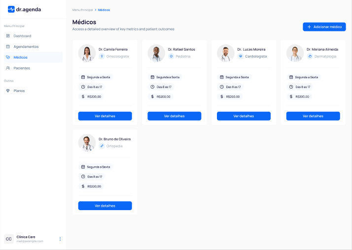
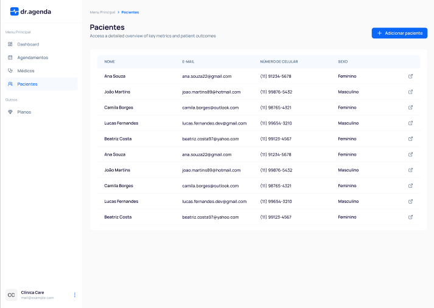
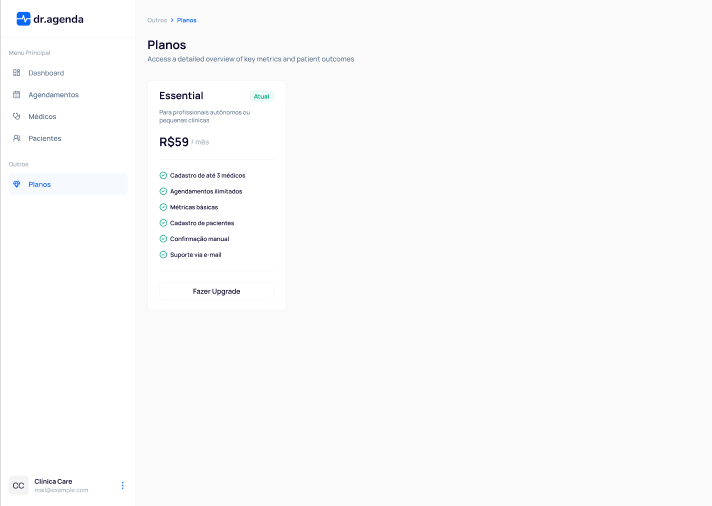
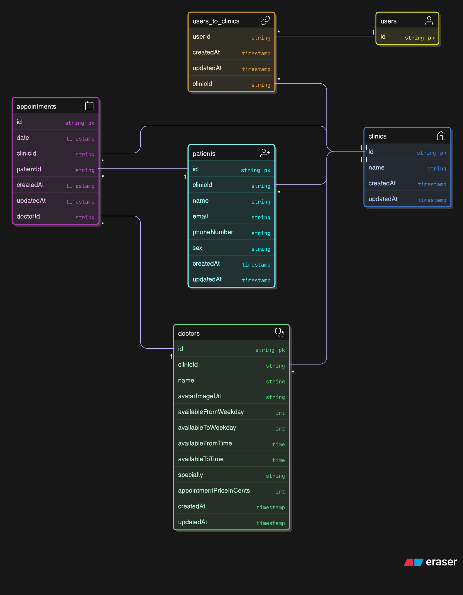

# 🩺 AgendaPro — SaaS de Agendamento para Clínicas com IA

SaaS de agendamento para clínicas médicas, oferecendo gestão completa de médicos, pacientes, agendamentos e planos de assinatura, com recursos de inteligência artificial para otimizar o atendimento e o fluxo clínico.

## 📸 Protótipo (Figma)

Confira o esboço visual da aplicação:

## 📊 Diagrama do Banco de Dados

## 📋 Funcionalidades

- **Autenticação**

  - Usuário pode ter várias clínicas

- **Gestão de Clínicas**

  - Gerenciamento de médicos (CRUD)

    - Disponibilidade de horários
    - Preço da consulta

  - Gerenciamento de pacientes (CRUD)

  - Agendamento de consultas (médico x paciente)

- **Planos de Assinatura**

  - Gestão de planos para acesso aos recursos da plataforma

- **Inteligência Artificial**
  - Recurso de IA para otimizar horários e sugerir agendamentos automáticos com base em disponibilidade, histórico e preferências dos pacientes.

---

## 🛠️ Tecnologias Utilizadas

- **Front-end:** React.js + Next.js + Tailwind CSS
- **Back-end:** Node.js + TypeScript
- **Banco de Dados:** PostgreSQL
- **Pagamentos:** Stripe
- **Inteligência Artificial:** OpenAI API (ou outro serviço integrável)
- **Estilização:** Tailwind CSS

---
